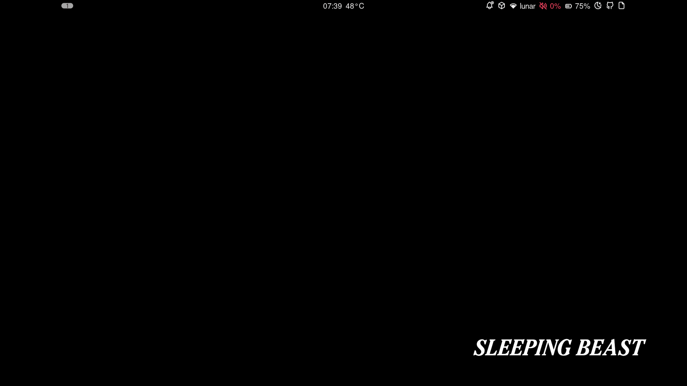
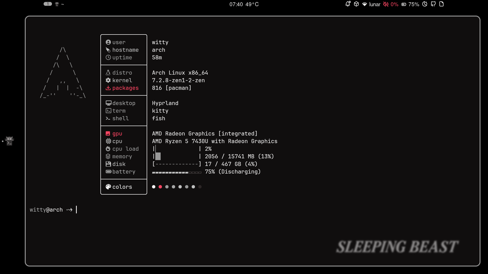
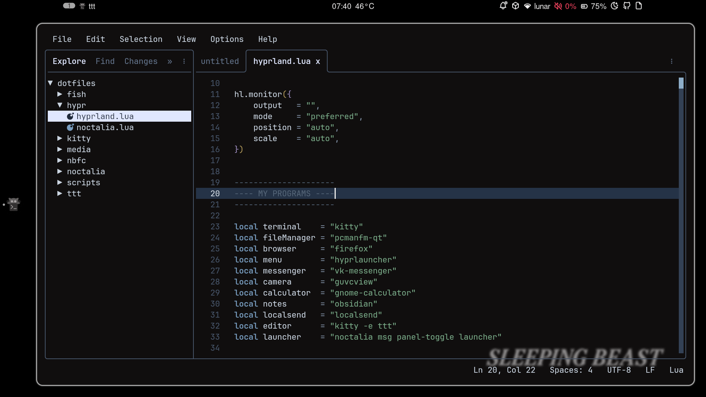
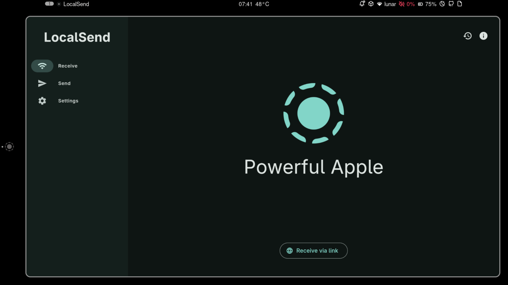

# dotfiles

my arch linux setup on a machcreator one r5.

## what's inside

- `hypr/` — hyprland config (lua)
- `kitty/` — terminal
- `fish/` — shell
- `ttt/` — ttt editor keybinds and settings
- `noctalia/` — shell + greeter settings
- `nbfc/` — fan curve for this laptop
- `xdg/` — mime + user dirs
- `media/` — screenshots
- `install.sh` — deploy script

## screenshots

### desktop

### kitty + catnap

### ttt editor

### localsend

## install

    git clone https://github.com/lunarshe11/dotfiles ~/dotfiles
    cd ~/dotfiles
    ./install.sh

script backs up existing configs to `~/.dotfiles-backup-<date>` before copying.

## keybinds

all bindings use `super` (win key) as mod.

### launch

| key | action |
|---|---|
| `super + enter` | kitty |
| `super + b` | firefox |
| `super + f` | file manager |
| `super + e` | ttt editor |
| `super + v` | vk messenger |
| `super + c` | camera |
| `super + l` | localsend |
| `super + space` | noctalia launcher |

### windows

| key | action |
|---|---|
| `super + x` | close window |
| `super + shift + v` | toggle floating |
| `super + p` | toggle pseudo |
| `super + j` | toggle split |

### focus

| key | action |
|---|---|
| `super + arrow` | move focus |

### workspaces

| key | action |
|---|---|
| `super + 1..6` | switch to workspace |
| `super + shift + 1..6` | move window to workspace |
| `super + mouse wheel` | cycle workspaces |

### scratchpad

| key | action |
|---|---|
| `super + s` | toggle terminal scratchpad |
| `super + shift + s` | send window to scratchpad |
| `super + shift + k` | calculator scratchpad |
| `super + shift + n` | notes scratchpad |

### screenshots

| key | action |
|---|---|
| `super + z` | region screenshot |
| `super + shift + z` | full screen screenshot |

### media

| key | action |
|---|---|
| `xf86audioup/down` | volume |
| `xf86audiomute` | mute |
| `xf86monbrightnessup/down` | brightness |
| `xf86audioplay/pause/next/prev` | playerctl |

### other

| key | action |
|---|---|
| `super + m` | exit hyprland |
| `alt + shift` | switch ru/en |

## hardware notes

- fans: `nbfc-linux` with a custom curve for `metaphyuni metawillbook 02`. drops from 96°c to 80°c under load. cools down to 50°c in 15 seconds after load.
- tdp: `ryzenadj` to keep cpu temps in check.
- keyboard backlight: only works via `fn` keys. no linux driver for ab819.
- camera: hardware kill switch (cuts `/dev/video*`).

## deps

### official

    sudo pacman -S --needed \
        hyprland kitty fish \
        grim slurp wl-clipboard libnotify \
        brightnessctl playerctl \
        tlp tlp-rdw ufw lm_sensors \
        docker ripgrep eza bat starship zoxide fzf \
        stress

### aur

    yay -S --needed \
        ttt catnap localsend-bin \
        nbfc-linux ryzenadj vk-messenger \
        noctalia-shell qt6ct-kde \
        ttf-jetbrains-mono-nerd

### optional

    pipx install ani2xcur

## license

mit
